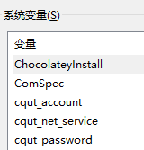

[](https://github.com/Akshay090/svg-banners)

# 🤔介绍

截止到2025年4月3日，这个程序**首次测试通过**。

# 🚀快速开始

设置环境变量`cqut_account`为你的账号，设置`cqut_password`为你的密码，设置`cqut_net_service`为你登录的校园网服务名，*即中国移动或中国电信*。



你也可使用Powershell环境变量的设置方法

```powershell
$env:cqut_account="<you_account>"
$env:cqut_password="<you_password>"
$env:cqut_net_service="<you_net_service>"
```

你还可以在同一目录下设置.env环境变量文件（推荐）

```
cqut_account=<you_account>
cqut_password=<you_password>
cqut_net_service=<you_net_service>
```

然后安装依赖并运行脚本：

```powershell
pip install -r requirements.txt # 安装依赖
python main.py # 运行脚本
```

# 💡升级后的登录逻辑

校园网升级后采用CAS单点登录流程：用户访问校园网时重定向至统一认证中心（如办事大厅），完成认证后返回服务票据（ST），校园网系统验证票据后授权访问。

# 🔧工具推荐

1.  `Burp Suite Professional`分析数据包

2.	`burp-requests`插件可将请求数据包拷贝为`python` `requests`脚本。

3.	`Netcat`可分析你的数据包构造与原始数据包的差异情况。

# 📚参考资料

> 我们学校是锐捷Portal 运营商应该是走了遭hash的 具体哪个没看过 不过都是通用的 可以Github找找 
>
> __DriveFLY

[IYATT关于CQUT校园网的博客](https://blog.iyatt.com/?p=6815)

[CAS单点登录原理](https://blog.csdn.net/ban_tang/article/details/80015946)

[集美大学锐捷ePortal Web 认证的登录脚本](https://github.com/callmeliwen/RuijiePortalLoginTool)

[Python实现RSA(jsencrypt)加密的两种方式](https://blog.csdn.net/wangzhuanjia/article/details/128382024)